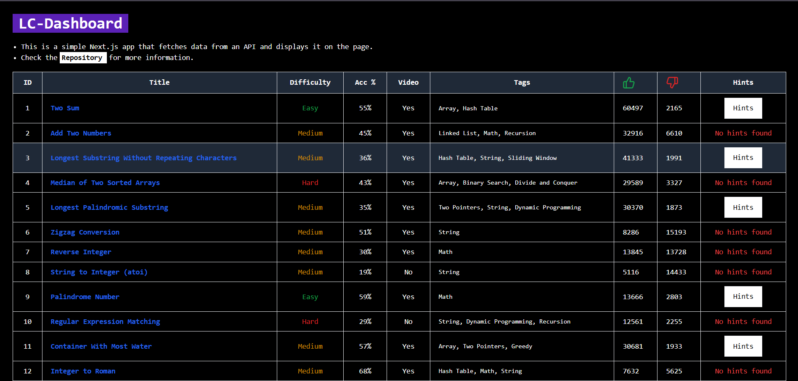

## LC Dashboard

> [!NOTE]
> This is the dashboard for the [LeetCode Journal](https://github.com/yashksaini-coder/Leetcode-Journal) project. 
> A simple NEXT.js web application that displays the data fetched from the API endpoint in a user-friendly way. 

---

    <h3>🚀 <a href="https://lc-dashboard.vercel.app/">Live Demo</a> 🚀</h3>
    

### TODO 🌟

- [x] Fetch data from the API endpoint.
- [x] Display the data in a user-friendly way.
- [X] Add a search bar to search for problems.
- [X] Add a feature to **filter** problems based on tags.
- [ ] Add a feature to mark problems as **done**, for each user.
- [X] Fix the tags filter by name, not `data-slug`.
- [X] Add Pagination.
- [X] Disable `Next` button when reached the last problem.

### 🛠 Tech Stack

- [React](https://reactjs.org/)
- [Next.js](https://nextjs.org/)
- [Tailwind CSS](https://tailwindcss.com/)
- [Vercel](https://vercel.com/)
- [Axios](https://axios-http.com/)

---

## 👤 Author

<a href="https://github.com/yashksaini-coder">
    <table>
        <tbody>
            <tr>
                <td align="left" valign="top" width="14.28%">
                    
                     
                    <h3>
                        <b>Yash K. Saini</b>
                    </h3>
                </td>
            </tr>
        </tbody>
    </table>
</a>

    <strong>🌟 If you find this project helpful, please give it a star on GitHub! 🌟</strong>

